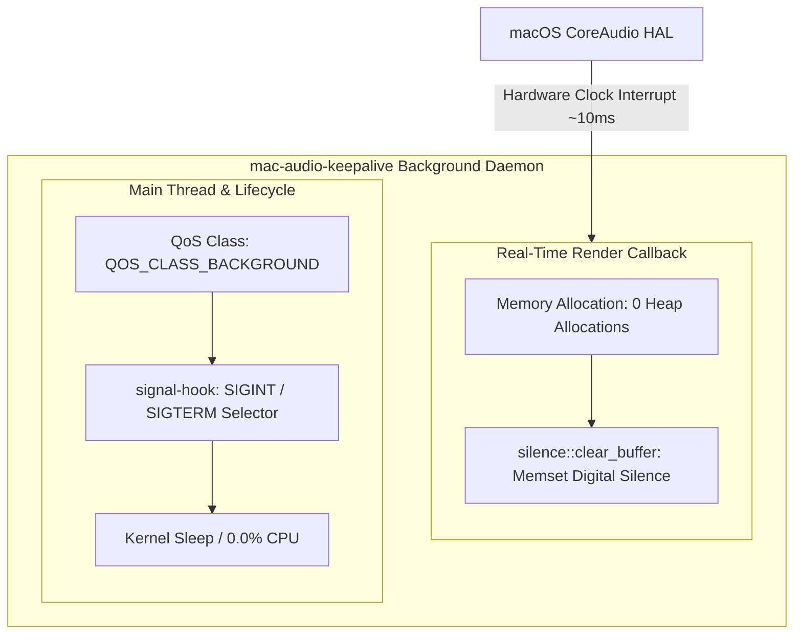

# mac-audio-keepalive

An ultra-lightweight, native macOS background daemon written in Rust that prevents digital active speakers, USB desktop monitors, and audio bridges from entering power-saving sleep mode.

It streams a continuous, in-audible silent PCM stream directly to the macOS CoreAudio Hardware Abstraction Layer (HAL) Default Output Unit—eliminating transient wake-up delays and audio popping without consuming measurable CPU or power resources.

## Problem Statement

macOS CoreAudio aggressively powers down USB audio bus streams after 3–5 seconds of silence to conserve power. When transient system audio occurs (e.g., volume control clicks, Slack pings, system notifications):

1. **Audio Truncation:** CoreAudio spends 200–500ms re-negotiating the hardware pipeline, clipping the first few hundred milliseconds of the transient.
2. **Hardware Popping:** Repeated wake/sleep cycles cause relay clicks or DAC pop sounds.
3. **Virtual Routing Bloat:** Third-party virtual audio driver workarounds (e.g., SoundSource, BlackHole) trigger privacy indicators (orange/purple menu bar dots), introduce DSP latency, or run complex driver stacks.

`mac-audio-keepalive` resolves this at the native hardware interrupt boundary without UI overlays or driver hooks.

## Quick Start & Installation

### Prerequisites

- **macOS:** 11.0 (Big Sur) or newer.
- **Architecture:** Apple Silicon (`aarch64-apple-darwin`) or Intel (`x86_64-apple-darwin`).
- **Toolchain:** [Rust & Cargo](https://www.rust-lang.org/tools/install) (Stable Edition 2021 or newer).

### Automated Setup

Clone the repository and run the setup script. This compiles the optimized release binary, installs it to `/usr/local/bin/mac-audio-keepalive`, and boots the `launchd` service.

```bash
git clone [https://github.com/eamq/mac-audio-keepalive.git](https://github.com/eamq/mac-audio-keepalive.git)
cd mac-audio-keepalive
./scripts/install.sh
```

### Manual Build

To compile the optimized binary manually without running the installer:

```bash
cargo build --release
```

### Service Management & Verification

- **Check Status:**
  ```bash
  launchctl list | grep mac-audio-keepalive
  ```
- **View Logs:**
  ```bash
  cat /tmp/mac-audio-keepalive.log
  cat /tmp/mac-audio-keepalive.err
  ```
- **Run Test Suite:**
  ```bash
  cargo test
  ```
- **Uninstall:**
  ```bash
  ./scripts/uninstall.sh
  ```

## Architecture & Design Principles



- **Zero-Allocation Real-time Thread:** The callback executes inside the OS high-priority audio render thread driven by hardware clock interrupts. It uses direct raw memory zeroes (`silence::clear_buffer`) without vector/slice bounds checks, locks, or heap allocations.
- **E-Core Pinning:** The process sets `QOS_CLASS_BACKGROUND` via `pthread_set_qos_class_self_np`, ensuring any initialization or non-interrupt processing runs exclusively on Apple Silicon Energy Cores (E-Cores).
- **Graceful Lifecycle Teardown:** Listens for `SIGINT` and `SIGTERM` via POSIX signal channels (`signal-hook`). When `launchd` stops the service, the main thread wakes to uninitialize the CoreAudio hardware pipeline cleanly (`AudioOutputUnitStop` / `AudioComponentInstanceDispose`).
- **Zero CPU Polling:** Main thread sleeps directly on OS kernel selectors via `signals.forever()`. Execution is entirely event-driven by incoming HAL interrupts.
- **OS Power Management Compliance:** Does not hold power assertions or prevent system sleep. When macOS enters display or system sleep, the HAL clock halts, freezing `mac-audio-keepalive` without battery drain.

## Performance Metrics

| Metric               | Measured Value            | Implementation Strategy                                    |
| :------------------- | :------------------------ | :--------------------------------------------------------- |
| **CPU Utilization**  | **`0.0%`** (Steady State) | Hardware interrupt callback + parked POSIX signal selector |
| **Memory (RSS)**     | **`~1.2 MB – 1.5 MB`**    | `panic = "abort"`, LTO enabled, zero dynamic dependencies  |
| **Thread QoS**       | `QOS_CLASS_BACKGROUND`    | Strictly scheduled on Efficiency Cores                     |
| **Heap Allocations** | **0** (in hot loop)       | Raw FFI buffer clearing via `coreaudio-sys`                |
